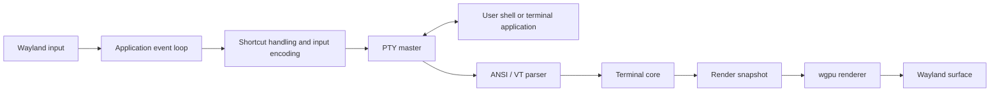

# Flash

> A native, GPU-rendered terminal emulator for Linux, built in Rust with Wayland as the primary platform target.

Flash is an early-stage terminal emulator project focused on **low input latency**, **fast startup**, **low memory overhead**, and **correct terminal behavior**. It will connect a real user shell to a Linux pseudo-terminal (PTY), interpret ANSI/VT output into a terminal grid, and render that grid through a GPU pipeline.

> **Project status: Phase 3 implemented, awaiting review.** Flash opens a Wayland window, presents a GPU-rendered background, starts the user’s shell in a PTY, and applies basic shell output to a fixed in-memory terminal grid. Text rendering and ANSI/VT parsing remain planned work.

## Goals

- Native Linux application with Wayland as the first-class backend
- GPU-rendered terminal surface with efficient batched text rendering
- Real shell and terminal application support through a PTY
- Correct, testable ANSI/VT terminal-state model
- Low-latency, keyboard-first interaction
- Compact memory use with bounded scrollback and glyph caches
- Human-editable TOML configuration following XDG conventions
- Measurable performance rather than unverified “fast terminal” claims

## Non-goals for v0.1

The first release deliberately avoids features that increase UI or protocol complexity before the terminal core is reliable:

- Tabs and split panes
- A shell, SSH client, or terminal multiplexer
- Plugins and a graphical settings interface
- Image protocols such as Kitty graphics or Sixel
- X11-specific optimization or tuning beyond a possible later fallback
- Advanced shell integration, search, ligatures, or daemon/client mode

## Architecture



### Responsibilities

| Layer | Responsibility |
| --- | --- |
| Platform / input | Window lifecycle, Wayland input, scaling, clipboard integration, and redraw scheduling. |
| PTY session | Creates the PTY, starts the user’s shell, forwards input, receives output, and propagates resize events. |
| ANSI/VT parser | Converts byte streams and control sequences into semantic terminal actions. |
| Terminal core | Owns the grid, cursor, modes, text attributes, primary/alternate screens, scrollback, and selection. |
| Font system | Resolves fonts, calculates cell metrics, rasterizes glyphs, handles fallback, and manages texture atlases. |
| Renderer | Draws backgrounds, text, decorations, selection, and cursor in a small number of GPU batches. |

The terminal core must remain independent of Wayland and GPU resources so it can be tested headlessly. The renderer consumes a render-oriented snapshot; it must not implement terminal semantics.

## Planned Technology Stack

| Concern | Initial choice | Notes |
| --- | --- | --- |
| Language | Rust | Native performance and memory safety. |
| Window and event loop | `winit` | Wayland is the primary supported backend. |
| GPU | `wgpu` | Used for surface presentation and batched text rendering. |
| PTY | `portable-pty` | Practical first implementation; a Linux-specific layer may replace it only if profiling justifies it. |
| VT parsing | `vte` or equivalent | Parser recognition is separated from terminal-state operations. |
| Fonts | `swash` / `fontdue` plus shaping support as needed | Rasterization, fallback, and glyph-atlas management. |
| Configuration | `serde` + `toml` | Typed configuration with validation. |
| Diagnostics | `tracing` | Structured, configurable diagnostics. |

Exact crate versions and APIs will be selected and pinned when implementation begins.

## Core Design Principles

### GPU-first, not GPU-only

The GPU draws the terminal surface. The CPU still owns input processing, PTY I/O, UTF-8 decoding, ANSI/VT parsing, and terminal state. Using a graphics API alone does not make a terminal fast; performance must be measured across the full pipeline.

### One owner for terminal state

The UI/event-loop thread will own the window, terminal state, and renderer. A dedicated PTY reader can perform blocking reads and send bounded byte chunks to the UI thread. This avoids unnecessary locking around the grid and makes state transitions predictable.

### Render at useful cadence

Terminal output can arrive much faster than a display refreshes. Flash will process all required bytes but coalesce state changes into redraws rather than queueing one frame per byte or parser action.

### Correctness before optimization

The project will build a functional, testable terminal core first. Profiling data—not assumptions—will guide later work on allocations, damage tracking, GPU uploads, and rendering buffers.

## v0.1 Scope

The minimum viable terminal is complete when it can:

- Open and reliably present a native Wayland window
- Spawn the user’s shell through a PTY
- Send keyboard input to that PTY and process shell output
- Display UTF-8 text in a GPU-rendered grid
- Handle core controls, cursor movement, erasing, and 16/256/RGB colors
- Render cursor, backgrounds, decorations, and basic selection
- Support primary and alternate screen buffers sufficiently for common TUIs such as Vim and `htop`
- Resize the grid and PTY when window geometry or scale changes
- Provide bounded scrollback, clipboard copy/paste, TOML configuration, and configurable shortcuts
- Remain stable under large-output stress tests

## Implementation Roadmap

| Phase | Outcome |
| --- | --- |
| 0 — Foundation | A `winit` Wayland window with lifecycle, resize, and tracing support. |
| 1 — GPU surface | A stable `wgpu` surface that clears and presents a background. |
| 2 — PTY session | A real shell attached to a PTY; input reaches it and output bytes are observable. |
| 3 — Terminal grid | Fixed-size grid, cursor, printable text, CR/LF/backspace/tab, wrapping, and scrolling tests. |
| 4 — Text renderer | Monospace font, ASCII glyph atlas, instanced GPU text, and cursor rendering. |
| 5 — ANSI/VT behavior | Cursor/erase controls, SGR styles and colors, scrolling regions, private modes, and alternate screen. |
| 6 — Resize and scale | Dynamic cell geometry, PTY resize propagation, and Wayland scale-factor handling. |
| 7 — User essentials | Scrollback, selection, clipboard, TOML configuration, shortcuts, and font-size controls. |
| 8 — Unicode | UTF-8, Unicode cell widths, combining marks, fallback fonts, and wide-cell behavior. |
| 9 — Performance | Repeatable benchmarks, profiling, allocation reductions, damage tracking, and latency measurement. |

The first major engineering milestone is a real shell whose parsed terminal state is drawn by Flash’s own GPU renderer. Features after that are incremental extensions of a working terminal emulator.

## Planned Repository Layout

```text
flash/
├── Cargo.toml
├── README.md
├── LICENSE
├── benches/
├── tests/
└── src/
    ├── main.rs
    ├── app.rs
    ├── event.rs
    ├── config/
    ├── pty/
    ├── terminal/
    ├── font/
    ├── renderer/
    └── platform/
```

## Configuration

Flash will work with defaults when no configuration file exists. Its eventual user configuration location will be:

```text
~/.config/flash/config.toml
```

An initial configuration shape is expected to cover font family and size, window padding/opacity, scrollback limits, cursor behavior, and keyboard shortcuts. Invalid values should be rejected with actionable file and field diagnostics.

## Compatibility and Security

`TERM` is a compatibility contract. Flash will not advertise terminal features it does not implement, and a matching terminfo strategy will be decided as ANSI/VT support becomes concrete.

Terminal output is untrusted input. The implementation will bound string-based escape-sequence payloads, fuzz parser/state transitions, avoid unbounded caches, and handle malformed output without panics. Sensitive protocols—including OSC 52 clipboard requests and hyperlink activation—will be conservative and configurable.

## Testing Strategy

- **Unit tests:** grid operations, cursor behavior, modes, SGR attributes, parser actions, input encoding, and configuration validation.
- **Golden tests:** byte streams processed by a headless terminal core compared with expected grid/cursor/mode snapshots.
- **Integration tests:** shell sessions in a PTY, resize propagation through `stty size`, alternate-screen restoration, high-output streams, and basic TUI compatibility.
- **Fuzzing:** malformed ANSI/VT streams must not panic, corrupt state, or cause unbounded resource use.

## Performance Methodology

Flash will track these metrics under documented, repeatable conditions:

- Process start to first usable presented frame
- Resident memory after startup and with controlled scrollback workloads
- Parser and output throughput for representative terminal streams
- CPU frame-build and GPU frame times
- Keyboard-event-to-present latency
- Frame-time distribution while scrolling or receiving heavy output

Useful Linux tools include `/usr/bin/time -v`, `hyperfine`, `perf`, flamegraph tooling, and `strace`. Comparisons with other terminals will use equivalent window size, font, shell, configuration, and compositor conditions; cold and warm starts will be reported separately.

## Development Status

Phase 3 adds a headless, fixed-size terminal grid with compact cells, cursor tracking, printable ASCII, CR/LF/backspace/tab controls, deferred wrapping, and scrolling. The next phase, after review approval, is Phase 4: load a monospace font, construct a glyph atlas, and render the grid and cursor through GPU instancing.

## References

- [Rust](https://www.rust-lang.org/)
- [`winit` documentation](https://docs.rs/winit)
- [`wgpu` documentation](https://docs.rs/wgpu)
- [`portable-pty` documentation](https://docs.rs/portable-pty)
- [Wayland documentation](https://wayland.freedesktop.org/)
- ECMA-48, xterm control-sequence, and terminfo references for terminal compatibility

---

Flash is intended to become fast because it is carefully engineered and measured—not merely because it uses the GPU.
