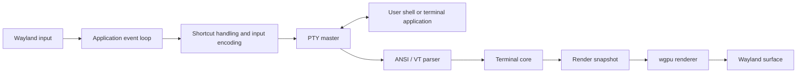

# Flash

> A native, GPU-rendered terminal emulator for Linux, built in Rust with Wayland as the primary platform target.

Flash is an early-stage terminal emulator project focused on **low input latency**, **fast startup**, **bounded memory use**, and **correct terminal behavior**. It connects a real user shell to a Linux pseudo-terminal (PTY), interprets ANSI/VT output into a terminal grid, and renders that grid through a GPU pipeline.

> **Project status: Phases 1–9 implemented and technically audited; visual identity pass complete.** Flash uses a spacious near-black/orange theme and a legacy-green cursor while retaining dirty-row rendering, partial GPU uploads, bounded queues, and event-driven idle behavior. The UI contains no permanent logo or decorative panel, and no later roadmap phase has started.

## Goals

- Native Linux application with Wayland as the first-class backend
- GPU-rendered terminal surface with efficient batched text rendering
- Real shell and terminal application support through a PTY
- Correct, testable ANSI/VT terminal-state model
- Low-latency, keyboard-first interaction
- Compact memory use with bounded scrollback and glyph caches
- Human-editable TOML configuration following XDG conventions
- Measurable performance rather than unverified “fast terminal” claims

## Requirements

- x86-64 Linux with glibc 2.36 or newer for the prebuilt v0.1.0 archive
- A Wayland session (native X11 sessions are not supported)
- A working Vulkan graphics driver
- Fontconfig (`fc-match`) and at least one outline monospace font
- A POSIX-compatible shell such as bash or zsh

Building from source additionally requires Rust 1.88 or newer. Flash resolves
JetBrains Mono through Fontconfig when available and otherwise accepts the
system's best monospace match; it does not assume Fedora's font package path.

## Installation

### Prebuilt release archive

After v0.1.0 is published, download both Linux assets from the
[GitHub release](https://github.com/vaishnav12200/flash/releases/tag/v0.1.0),
then verify and install them for the current user:

```sh
sha256sum --check flash-v0.1.0-x86_64-unknown-linux-gnu.tar.gz.sha256
tar -xzf flash-v0.1.0-x86_64-unknown-linux-gnu.tar.gz
cd flash-v0.1.0-x86_64-unknown-linux-gnu
install -Dm755 bin/flash "$HOME/.local/bin/flash"
install -Dm644 share/applications/flash.desktop \
  "$HOME/.local/share/applications/flash.desktop"
```

Ensure `$HOME/.local/bin` is in `PATH`, then start Flash from the application
launcher or run `flash` inside an existing Wayland session.

### Build from source

```sh
git clone https://github.com/vaishnav12200/flash.git
cd flash
cargo build --release --locked
install -Dm755 target/release/flash "$HOME/.local/bin/flash"
install -Dm644 packaging/flash.desktop \
  "$HOME/.local/share/applications/flash.desktop"
```

### Uninstall

Remove only the files installed above. Configuration is retained unless you
explicitly remove it:

```sh
rm "$HOME/.local/bin/flash"
rm "$HOME/.local/share/applications/flash.desktop"
```

The optional configuration directory is `$XDG_CONFIG_HOME/flash` or
`$HOME/.config/flash` when `XDG_CONFIG_HOME` is unset.

## Non-goals for v0.1

The first release deliberately avoids features that increase UI or protocol complexity before the terminal core is reliable:

- Tabs and split panes
- A shell, SSH client, or terminal multiplexer
- Plugins and a graphical settings interface
- Image protocols such as Kitty graphics or Sixel
- X11-specific optimization or tuning beyond a possible later fallback
- Advanced shell integration, search, ligatures, or daemon/client mode

## Architecture



### Responsibilities

| Layer | Responsibility |
| --- | --- |
| Platform / input | Window lifecycle, Wayland input, scaling, clipboard integration, and redraw scheduling. |
| PTY session | Creates the PTY, starts the user’s shell, forwards input, receives output, and propagates resize events. |
| ANSI/VT parser | Converts byte streams and control sequences into semantic terminal actions. |
| Terminal core | Owns the grid, cursor, modes, text attributes, primary/alternate screens, scrollback, and selection. |
| Font system | Resolves fonts, calculates cell metrics, rasterizes glyphs, handles fallback, and manages texture atlases. |
| Renderer | Draws backgrounds, text, decorations, selection, and cursor in a small number of GPU batches. |

The terminal core must remain independent of Wayland and GPU resources so it can be tested headlessly. The renderer consumes a render-oriented snapshot; it must not implement terminal semantics.

## Planned Technology Stack

| Concern | Initial choice | Notes |
| --- | --- | --- |
| Language | Rust | Native performance and memory safety. |
| Window and event loop | `winit` | Wayland is the primary supported backend. |
| GPU | `wgpu` | Used for surface presentation and batched text rendering. |
| PTY | `portable-pty` | Practical first implementation; a Linux-specific layer may replace it only if profiling justifies it. |
| VT parsing | `vte` or equivalent | Parser recognition is separated from terminal-state operations. |
| Fonts | `swash` / `fontdue` plus shaping support as needed | Rasterization, fallback, and glyph-atlas management. |
| Configuration | `serde` + `toml` | Typed configuration with validation. |
| Diagnostics | `tracing` | Structured, configurable diagnostics. |

Exact crate versions and APIs will be selected and pinned when implementation begins.

## Core Design Principles

### GPU-first, not GPU-only

The GPU draws the terminal surface. The CPU still owns input processing, PTY I/O, UTF-8 decoding, ANSI/VT parsing, and terminal state. Using a graphics API alone does not make a terminal fast; performance must be measured across the full pipeline.

### One owner for terminal state

The UI/event-loop thread will own the window, terminal state, and renderer. A dedicated PTY reader can perform blocking reads and send bounded byte chunks to the UI thread. This avoids unnecessary locking around the grid and makes state transitions predictable.

### Render at useful cadence

Terminal output can arrive much faster than a display refreshes. Flash will process all required bytes but coalesce state changes into redraws rather than queueing one frame per byte or parser action.

### Correctness before optimization

The project will build a functional, testable terminal core first. Profiling data—not assumptions—will guide later work on allocations, damage tracking, GPU uploads, and rendering buffers.

## v0.1 Scope

The minimum viable terminal is complete when it can:

- Open and reliably present a native Wayland window
- Spawn the user’s shell through a PTY
- Send keyboard input to that PTY and process shell output
- Display UTF-8 text in a GPU-rendered grid
- Handle core controls, cursor movement, erasing, and 16/256/RGB colors
- Render cursor, backgrounds, decorations, and basic selection
- Support primary and alternate screen buffers sufficiently for common TUIs such as Vim and `htop`
- Resize the grid and PTY when window geometry or scale changes
- Provide bounded scrollback, clipboard copy/paste, TOML configuration, and configurable shortcuts
- Remain stable under large-output stress tests

## Implementation Roadmap

| Phase | Outcome |
| --- | --- |
| 0 — Foundation | A `winit` Wayland window with lifecycle, resize, and tracing support. |
| 1 — GPU surface | A stable `wgpu` surface that clears and presents a background. |
| 2 — PTY session | A real shell attached to a PTY; input reaches it and output bytes are observable. |
| 3 — Terminal grid | Fixed-size grid, cursor, printable text, CR/LF/backspace/tab, wrapping, and scrolling tests. |
| 4 — Text renderer | Monospace font, ASCII glyph atlas, instanced GPU text, and cursor rendering. |
| 5 — ANSI/VT behavior | Cursor/erase controls, SGR styles and colors, scrolling regions, private modes, and alternate screen. |
| 6 — Resize and scale | Dynamic cell geometry, PTY resize propagation, and Wayland scale-factor handling. |
| 7 — User essentials | Scrollback, selection, clipboard, TOML configuration, shortcuts, and font-size controls. |
| 8 — Unicode | UTF-8, Unicode cell widths, combining marks, fallback fonts, and wide-cell behavior. |
| 9 — Performance | Repeatable benchmarks, profiling, allocation reductions, damage tracking, and latency measurement. |

The first major engineering milestone is a real shell whose parsed terminal state is drawn by Flash’s own GPU renderer. Features after that are incremental extensions of a working terminal emulator.

## Planned Repository Layout

```text
flash/
├── Cargo.toml
├── README.md
├── LICENSE
├── benches/
├── tests/
└── src/
    ├── main.rs
    ├── app.rs
    ├── event.rs
    ├── config/
    ├── pty/
    ├── terminal/
    ├── font/
    ├── renderer/
    └── platform/
```

## Configuration

Flash works with defaults when no configuration file exists. It reads `$XDG_CONFIG_HOME/flash/config.toml`, falling back to:

```text
~/.config/flash/config.toml
```

All fields are optional. The current schema and defaults are:

```toml
[font]
fallback = []
size = 18.0

[window]
padding_x = 20.0
padding_y = 16.0

[colors]
background = "#080A0D"
foreground = "#D8DEE9"
cursor = "#41E66B"
accent = "#FF8A2A"
selection_background = "#3A261E"
selection_foreground = "#F2E9E1"
black = "#161A1F"
red = "#D96666"
green = "#72C991"
yellow = "#D99A5E"
blue = "#6A9FD0"
magenta = "#B27AB4"
cyan = "#58B8B0"
white = "#C5CBD3"
bright_black = "#606873"
bright_red = "#E27772"
bright_green = "#8AD5A5"
bright_yellow = "#E8BB6A"
bright_blue = "#80B1DF"
bright_magenta = "#C48BC5"
bright_cyan = "#70CEC2"
bright_white = "#F0F2F5"

[cursor]
style = "block" # block, beam, or underline
blink = true
blink_interval = 600 # milliseconds, 100..=2000

[scrollback]
lines = 10000

[keybindings]
copy = "Ctrl+Shift+C"
paste = "Ctrl+Shift+V"
increase_font = "Ctrl+Shift+Plus"
decrease_font = "Ctrl+Minus"
reset_font = "Ctrl+0"
scroll_page_up = "Shift+PageUp"
scroll_page_down = "Shift+PageDown"
scroll_to_bottom = "Ctrl+Shift+End"
```

Omit `font.path` to select a portable Fontconfig monospace default. To pin a
specific face, set it to an absolute `.ttf` or `.otf` path, for example:

```toml
[font]
path = "/usr/share/fonts/truetype/dejavu/DejaVuSansMono.ttf"
```

Colors use `#RRGGBB` sRGB values and are converted to the GPU surface's linear working space, so configured values appear as authored. The legacy `window.foreground` and `window.background` keys remain accepted and override their `[colors]` equivalents. Font size is restricted to `6..=72`, padding is specified in logical pixels and must be non-negative, and scrollback is capped at one million lines. Invalid files produce field-specific diagnostics and Flash safely falls back to defaults for that launch.

Cursor blinking uses `ControlFlow::WaitUntil`: Flash wakes only at a configured visibility transition, rebuilds only the cursor row, and immediately restores the cursor when keyboard input or PTY output arrives. Set `blink = false` for fully static idle behavior. Window opacity remains deliberately unsupported because native Wayland alpha/compositor behavior has not been validated across target desktops. Window controls use winit's dark Adwaita Wayland decorations; terminal rendering remains independent of window chrome.

Flash deliberately renders no built-in logo, watermark, system-information panel, or prompt text. Shell prompts and any artwork from programs such as fastfetch remain ordinary PTY output. The warm ANSI palette, configurable spacing, selection treatment, and high-contrast green cursor provide the visual identity without guessing at shell-owned prompt semantics.

Optional, terminal-independent zsh and fastfetch examples live under
[`contrib/`](contrib/README.md). Flash never installs, sources, or writes those
files automatically, so personal shell presentation stays separate from the
terminal emulator.

`font.fallback` is an optional ordered list of font files. Flash tries the configured primary face first, then configured fallback faces, then a character-specific system face reported by Fontconfig. Missing faces are parsed on a bounded background loader instead of the render thread; a replacement glyph is shown until the requested face is ready. Unicode glyphs are rasterized lazily into a bounded texture atlas.

Normal terminal input remains distinct from shortcuts: plain `Ctrl+C` sends the PTY interrupt byte, while `Ctrl+Shift+C` copies a selection. Arrow, navigation, editing, Ctrl-letter, and Alt-modified keys are encoded and sent to the PTY rather than moving Flash’s display cursor directly.

## Compatibility and Security

`TERM` is a compatibility contract. Flash currently uses `xterm-256color` as a pragmatic compatibility baseline for the implemented common VT/xterm subset and identifies itself separately through `TERM_PROGRAM=flash`. A dedicated Flash terminfo entry remains future compatibility work; applications must not assume Flash implements every private xterm extension.

Terminal output is untrusted input. The implementation will bound string-based escape-sequence payloads, fuzz parser/state transitions, avoid unbounded caches, and handle malformed output without panics. Sensitive protocols—including OSC 52 clipboard requests and hyperlink activation—will be conservative and configurable.

## Testing Strategy

- **Unit tests:** grid operations, cursor behavior, modes, SGR attributes, parser actions, input encoding, and configuration validation.
- **Golden tests:** byte streams processed by a headless terminal core compared with expected grid/cursor/mode snapshots.
- **Integration tests:** shell sessions in a PTY, resize propagation through `stty size`, alternate-screen restoration, high-output streams, and basic TUI compatibility.
- **Fuzzing:** malformed ANSI/VT streams must not panic, corrupt state, or cause unbounded resource use.

## Performance Methodology

Flash will track these metrics under documented, repeatable conditions:

- Process start to first usable presented frame
- Resident memory after startup and with controlled scrollback workloads
- Parser and output throughput for representative terminal streams
- CPU frame-build and GPU frame times
- Keyboard-event-to-present latency
- Frame-time distribution while scrolling or receiving heavy output

Useful Linux tools include `/usr/bin/time -v`, `hyperfine`, `perf`, flamegraph tooling, and `strace`. Comparisons with other terminals will use equivalent window size, font, shell, configuration, and compositor conditions; cold and warm starts will be reported separately.

Set `RUST_LOG=flash=debug` to emit startup, PTY-read-to-UI, parser-batch, PTY-write, font-fallback, dirty-row rebuild, partial atlas upload, partial instance upload, redraw-to-present, and render-submit timings. At info level, Flash reports first-window/renderer/PTY/present milestones, fixed-bucket p50/p95/p99 frame summaries, and one-second PTY-to-present summaries. `FLASH_INPUT_LATENCY_PROBE=1` injects one byte after the first usable frame and reports the resulting input-to-present latency without requiring external input automation. Startup keeps the Wayland window hidden until a content-bearing frame has been presented when shell output arrives promptly, with a one-shot fallback deadline for silent shells. PTY input uses a bounded asynchronous writer queue, sustained output is parsed in bounded time/byte slices that yield to presentation, and fallback fonts are selected and parsed off the render thread. All three workers block while idle rather than polling.

The exact Phase 9 benchmark commands, environment, baseline, audit reruns, and results are recorded in [`PERFORMANCE.md`](PERFORMANCE.md). `scripts/phase9-unicode-audit.sh` provides a repeatable Unicode, color, PTY-size, and alternate-screen runtime workload.

## Unicode and Emoji Policy

Terminal layout follows Unicode cell-width rules independently of visual glyph metrics. Wide characters own a leading cell plus a protected continuation cell; combining marks remain attached to their base cell; selection and clipboard extraction skip continuation cells while preserving combining sequences. Split UTF-8 sequences from separate PTY reads are retained and decoded correctly.

For v0.1, emoji are rendered as monochrome outline glyphs through the same font atlas as text. Regional-indicator flags, skin-tone modifiers, keycaps, and zero-width-joiner sequences retain one logical cluster span, but Flash does not render color bitmap/COLR emoji or perform discretionary text ligatures. Unsupported glyphs use a replacement glyph rather than changing terminal layout.

## Development Status

Phase 9 adds a repeatable allocation-counting throughput benchmark; instrumented startup, PTY, frame-distribution, and input-to-present measurements; allocation-free CSI parameter extraction; reusable scrollback rows; batched PTY parsing; shared backing storage for large paste chunks; terminal row-damage versions; per-row render caches; sparse instance-buffer writes; and dirty-region glyph-atlas uploads. The Phase 1–9 audit additionally hardened cursor/mode semantics, mouse reporting and selection separation, screen-buffer transitions, PTY shutdown, startup sizing, renderer invalidation, atlas bounds, and runtime diagnostics. The visual-identity pass adds Flash's near-black/orange palette, color-space-correct output, logical padding, configurable cursor geometry/blinking, warm selection colors, and a logo-free minimal surface without modifying the terminal model. Phase 9 and visual identity work are complete; no later phase has started.

## Known limitations

- v0.1.0 is native Wayland-only and ships a prebuilt x86-64 glibc binary.
- `TERM=xterm-256color` is a compatibility baseline; Flash does not implement
  every xterm private extension and does not yet ship dedicated terminfo.
- Existing screen lines are resized without shell-style text reflow.
- Complex text shaping, discretionary ligatures, and color emoji are not
  supported. Unsupported glyphs use a replacement character.
- OSC 52 clipboard writes, clickable hyperlinks, Kitty graphics, and Sixel are
  intentionally unsupported.
- Tabs, split panes, configuration UI, and X11 fallback are outside v0.1.0.

## Reporting bugs

Search existing [GitHub issues](https://github.com/vaishnav12200/flash/issues)
before filing a new one. Include the Flash version, distribution, desktop and
Wayland compositor, GPU/driver, shell, reproduction steps, and relevant logs
from `RUST_LOG=flash=debug flash`. For rendering bugs, state whether they also
occur with the default configuration and include a screenshot only after
checking it for private shell output. Never post credentials, full shell
history, or clipboard contents. Report security-sensitive problems through the
private process in [`SECURITY.md`](SECURITY.md), not a public issue.

## License

Flash is dual-licensed under your choice of the
[MIT License](LICENSE-MIT) or [Apache License 2.0](LICENSE-APACHE).

## References

- [Rust](https://www.rust-lang.org/)
- [`winit` documentation](https://docs.rs/winit)
- [`wgpu` documentation](https://docs.rs/wgpu)
- [`portable-pty` documentation](https://docs.rs/portable-pty)
- [Wayland documentation](https://wayland.freedesktop.org/)
- ECMA-48, xterm control-sequence, and terminfo references for terminal compatibility

---

Flash is intended to become fast because it is carefully engineered and measured—not merely because it uses the GPU.
